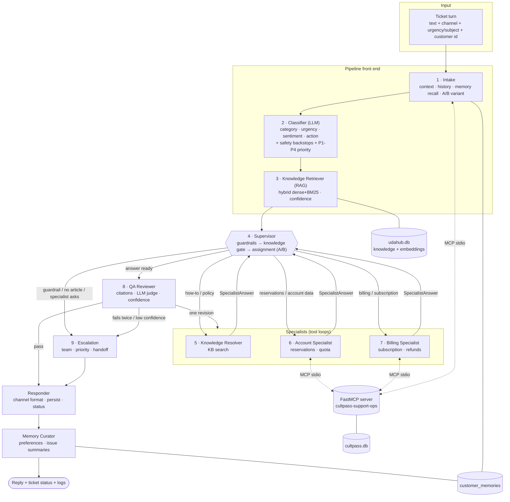
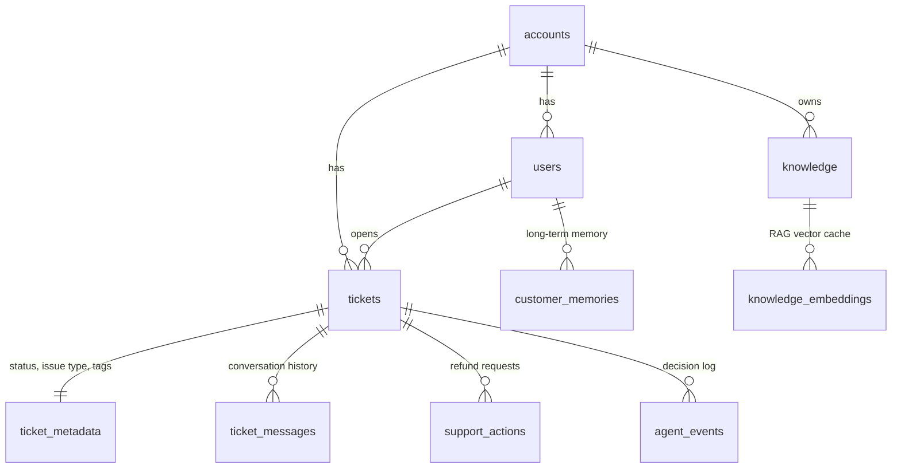

# UDA-Hub: Multi-Agent Architecture

UDA-Hub is a Universal Decision Agent for customer support. It reads a support
ticket, works out what it is about and how urgent it is, and sends it to the
agent best placed to handle it. That agent answers from the knowledge base or
acts on the customer's account through tools. A QA agent checks the answer
against its evidence before it is sent. If the system cannot resolve the ticket
with confidence, it escalates to a human with a handoff summary. It also
remembers each customer across sessions. The first client is **CultPass**, a
cultural-experiences subscription in Brazil.

This document is the design that the code in `agentic/` implements. Section
numbers are referenced from code comments.

| Document | Content |
|---|---|
| `ARCHITECTURE.md` (this file) | pattern, agents, flows, routing, memory, tools, logging, error handling |
| [`RAG.md`](RAG.md) | how knowledge retrieval, fusion and confidence scoring work |
| [`workflow_graph.png`](workflow_graph.png) / [`.mmd`](workflow_graph.mmd) | the compiled LangGraph graph, exported from the code (`orchestrator.get_graph()`) |

---

## 1. Architectural pattern: Supervisor

UDA-Hub uses the **Supervisor pattern**, with a short deterministic intake
pipeline in front of the supervisor:

* **Pipeline front end** (intake → classifier → knowledge retriever). Every
  ticket needs the same three things before any decision: context, a
  classification and evidence. Running them as fixed steps makes every
  routing decision see the same, complete picture.
* **Supervisor hub**. A single supervisor owns the decision of *who works on
  the ticket next*. Each specialist reports back to it, and the supervisor
  then sends the result to QA, passes it to another specialist, or escalates.
  Specialists never call each other directly. A hand-off is a request that
  the supervisor approves, which keeps control flow auditable and bounded
  (hop limit).
* **Review and exit** (QA reviewer → responder → memory curator). No reply
  reaches the customer without passing QA or being written by the escalation
  agent, and every turn ends by recording the outcome and updating memory.

**Why not the other patterns?** A *network* (every agent can call every
other) makes it hard to guarantee that guardrails such as "blocked accounts
go to Trust & Safety" are always applied, and it cannot bound the number of
hops. A deep *hierarchy* (team supervisors under a top supervisor) is not
justified with three specialists; the supervisor's routing table is the
team layer. The Supervisor pattern gives one place for policy, one place for
logging decisions, and least-privilege specialists.

---

## 2. Agents and responsibilities

UDA-Hub has **nine agents**, all nodes of one LangGraph `StateGraph`. Four of
them use an LLM with tools or structured output. The others are
deterministic by design: policy, persistence and formatting should not
depend on a model.

| # | Agent (node) | Type | Responsibility | Reads | Writes | Tools |
|---|---|---|---|---|---|---|
| 1 | **intake** | deterministic | Resolve or create the ticket and customer, normalise text per channel, persist the message, load the CultPass profile, prior tickets and long-term memories, assign the A/B variant, reset per-turn state | ticket DB, CultPass (tool), memory | `ticket`, `customer`, `history`, `memories`, `ab_variant`, `user_message` | `get_customer_profile` |
| 2 | **classifier** | LLM (structured) + rules | Category, intent, urgency, complexity, sentiment, requested action, wants-human, legal threat, language. Safety backstops override the LLM when keywords show a safety, security, legal or human request. Computes P1-P4 priority from content and metadata | message, conversation, memory, metadata | `classification`, `priority`, ticket metadata | none |
| 3 | **knowledge_retriever** | deterministic (RAG) | Hybrid dense + BM25 search of the knowledge base, boosted by the classifier's category, confidence score | message, intent | `retrieval` | knowledge index |
| 4 | **supervisor** | rules + LLM (variant B) | Guardrails, knowledge gate, specialist assignment (A/B), post-specialist decisions, hop cap | everything above, `specialist_result` | `route`, `routing_history`, `escalation` | none |
| 5 | **knowledge_resolver** | LLM tool loop | Answer how-to, policy and troubleshooting questions strictly from articles. Can run follow-up KB searches and hand off to an account-capable specialist | articles, memory, conversation | `specialist_result` | `search_knowledge_base` |
| 6 | **account_specialist** | LLM tool loop | The customer's reservations and account: list, reserve, cancel, quota and experience search | same + customer | `specialist_result`, `tool_calls` | `get_customer_profile`, `list_reservations`, `search_experiences`, `reserve_experience`, `cancel_reservation`, `search_knowledge_base` |
| 7 | **billing_specialist** | LLM tool loop | Subscription status and changes (pause, resume, cancel), payment problems, refund *requests* | same + customer | `specialist_result`, `tool_calls` | `get_customer_profile`, `pause_subscription`, `resume_subscription`, `cancel_subscription`, `submit_refund_request`, `search_knowledge_base` |
| 8 | **qa_reviewer** | rules + LLM judge | Citation validity, groundedness, "claimed action really happened", answers-the-question, final confidence; one revision round, then escalation | `specialist_result`, articles, tool results | `qa`, `final` or `escalation` | none |
| 9 | **escalation** | LLM (structured) + rules | Team and priority by policy; grounded customer message and internal handoff summary; ticket status and handoff note | classification, reason, conversation, tools used, policy articles | `final`, `escalation`, handoff message | none |
| + | **responder** | deterministic | Channel formatting (email, chat, social, phone), persist the AI message, set ticket status, log the resolution | `final` | `messages`, ticket DB | none |
| + | **memory_curator** | LLM (structured, gated) + rules | Extract durable preferences and facts; store a resolved or escalated issue summary per ticket | message, `final` | `customer_memories` | memory store |

Responder and memory curator are listed with "+" because they are
infrastructure agents. Even without them there are seven specialised
decision-making agents, well above the four the brief requires.

**Least privilege.** The knowledge resolver has no account tools. The account
specialist cannot touch billing, and the billing specialist cannot touch
reservations. No LLM ever sees or chooses a `user_id` (see section 8).

---

## 3. Inputs and outputs

### 3.1 Input: a ticket turn

A connector (Zendesk, Intercom, email, or the chat UI) calls
`submit_ticket(external_user_id, channel=..., urgency=..., subject=...)`
once. It then calls `send_message(graph, ticket_id, text)` for each customer
message. The graph input is:

```python
{"messages": [HumanMessage(text)], "ticket_id": "<uuid>"}   # config: {"configurable": {"thread_id": ticket_id}}
```

Metadata used by the system:

| Metadata | Source | Used for |
|---|---|---|
| `channel` (chat, email, social, phone, web_form) | ticket | text normalisation, reply formatting |
| `urgency`, `subject` flags from the source system | ticket tags | classifier prompt, priority score |
| `created_at` → ticket age | ticket | priority (+0.5 when older than 24 h) |
| customer tier, subscription status, blocked flag, quota | CultPass via tool | priority, guardrail G3, specialist context |
| prior tickets and unresolved count | UDA-Hub history | priority, guardrail G8, personalisation |
| long-term memories | `customer_memories` | personalisation, context |

### 3.2 Ticket taxonomy

`login_access`, `account_management`, `account_security`, `billing_payment`,
`refund_request`, `subscription_management`, `reservation_booking`,
`reservation_change`, `technical_issue`, `safety_incident`,
`privacy_request`, `general_inquiry`, `other`. Every category except `other`
has at least one knowledge article (29 articles; see
`scripts/build_articles.py`).

### 3.3 Output

Each turn returns the full state. The customer-facing result is `state["final"]`:

```python
{"status": "resolved" | "needs_customer_input" | "escalated",
 "response": "<channel-formatted reply>",
 "citations": [{"ref": "KB-1a2b3c", "title": "..."}],   # the KB articles the reply is based on
 "confidence": 0.93, "handled_by": "account_specialist",
 "team": "billing_lead", "priority": "P2"}             # escalations only
```

Side effects: ticket status (`resolved`, `pending_customer`, `escalated`),
`main_issue_type` and tags (`priority:P2`, `sentiment:negative`,
`variant:rules_first`, ...). Both the customer message and the reply are
stored as `ticket_messages`. Escalations add a `[HANDOFF -> team | P1 | SLA]`
system message. Account changes go to `cultpass.db`, refund requests to
`support_actions`, and events to the log.

### 3.4 How different kinds of input are handled

| Input | Handling |
|---|---|
| How-to or policy question | classifier → retriever → **knowledge_resolver** → QA → resolved with citations |
| Request needing the customer's data or an action | → **account_specialist** or **billing_specialist**; tools run over MCP; QA checks that claimed actions really happened |
| Ambiguous request ("cancel my reservation" with two bookings) | specialist lists the options and asks → `needs_customer_input`; the next message on the same thread continues with short-term memory |
| Refund | billing specialist submits a request (never approves it) → escalated to the billing lead |
| Safety, security, blocked account, privacy, legal threat, "I want a human", critical urgency, repeat unresolved contacts | guardrails → **escalation** before any specialist runs |
| Anything the knowledge base does not cover | knowledge gate → **escalation** (never answered from the model's own knowledge) |
| Empty message | intake asks for details; no LLM call |
| Email with quoted history or signature | intake strips it before classification |
| Social media | reply shortened, emails masked, "we've sent you a DM" |
| Other languages | classifier detects the language; agents reply in it (evaluation ticket T29 is in Portuguese) |
| Unknown thread or customer | a guest ticket is created; account tools refuse (`forbidden`) and the request escalates |

---

## 4. Flow of information and decisions

### 4.1 Architecture diagram



ASCII version:

```
ticket ─► intake ─► classifier ─► knowledge_retriever ─► SUPERVISOR ◄──────────────┐
                                                        │   │   │   │               │
                          guardrail/no-article ◄────────┘   │   │   └► billing ─────┤
                                   │            knowledge ◄─┘   └► account ─────────┤
                                   │            resolver ───────────────────────────┘
                                   ▼                         answer ready
                              escalation ◄── fail ── qa_reviewer ◄──── supervisor
                                   │                     │ pass (or 1 revision ► specialist)
                                   └────► responder ◄────┘
                                              │
                                        memory_curator ─► END
```

The compiled graph exported from the code is in `workflow_graph.png`.

### 4.2 Priority (metadata-aware)

`priority_score` in `agents/classifier.py`:

| Signal | Points |
|---|---|
| urgency low / normal / high / critical | 1 / 2 / 3 / 4 |
| sentiment negative / very negative | +0.5 / +1 |
| premium member | +0.5 |
| the customer has another unresolved ticket from the last 14 days | +1 |
| ticket open for 24 h or more | +0.5 |
| source system flagged it urgent | +0.5 |

A score of 4.5 or more is P1, 3.5 or more is P2, 2 or more is P3, and
anything lower is P4. Priority goes on the ticket, into the escalation
handoff and into the SLA stated to the customer.

### 4.3 Supervisor decision rules

The supervisor evaluates its rules in this order. The first match wins, and
each decision is logged with its rule id.

| Rule | Condition | Route | Team |
|---|---|---|---|
| S0_error | an upstream node failed | escalation | tier2_support |
| S1_hops | more than 4 specialist hops | escalation | tier2_support |
| S2_specialist | specialist returned `outcome=escalate` (e.g. refund awaiting approval) | escalation | by reason |
| S3_handoff | specialist set `handoff_to` another specialist | that specialist | |
| S4_review | specialist answered | qa_reviewer | |
| G1_safety | category `safety_incident` | escalation | trust_and_safety (P1) |
| G2_security | category `account_security` | escalation | trust_and_safety (P1) |
| G3_blocked | customer blocked **and** an account-related category | escalation | trust_and_safety |
| G4_privacy | category `privacy_request` | escalation | privacy_team |
| G5_legal | legal or chargeback threat | escalation | billing_lead |
| G6_human | customer asks for a human | escalation | tier2_support |
| G7_critical | urgency critical | escalation | tier2_support |
| G8_repeat | 2 or more earlier tickets about the **same issue** still unresolved in the last 14 days (unrelated open escalations do not count) | escalation | tier2_support |
| A_rules_first / A_llm_supervisor | assignment (section 4.4) | a specialist | |
| K1_no_article | assignment is `knowledge_resolver` but retrieval confidence is below 0.35 | escalation | tier2_support |

The guardrails are code, not prompt, because a missed safety escalation is
the costliest error the system can make. The classifier's keyword backstops
feed them, so G1, G2, G5 and G6 fire even if the LLM mislabels the ticket
(tested in `tests/test_routing.py::test_backstops_override_a_wrong_classification`).

### 4.4 Assignment (the A/B-tested step)

**Variant A, `rules_first`** (`supervisor.rules_first`):

| Classification | Specialist |
|---|---|
| `billing_payment`, `refund_request`, or action pause, resume, cancel subscription or refund | billing_specialist |
| action reserve or cancel reservation, or check account status | account_specialist |
| `subscription_management` that needs the customer's own data | billing_specialist |
| `reservation_*` or `account_management` that needs the customer's own data | account_specialist |
| everything else | knowledge_resolver |

**Variant B, `llm_supervisor`**: the LLM gets the classification, the top
article titles and the conversation, and returns a `RoutingDecision`
(`next_agent`, `reason`, `confidence`). The guardrails and the knowledge gate
still apply, so the experiment cannot weaken safety.

### 4.5 Message passing between agents

Agents share one typed state (`agentic/state.py::UDAHubState`) and pass
structured Pydantic objects through it:

* classifier → everyone: `TicketClassification`
* retriever → supervisor and specialists: `retrieval` (articles with refs and relevance, confidence)
* specialist → supervisor: `SpecialistAnswer` (reply, `cited_articles`,
  `outcome`, self-rated confidence, `escalation_reason`, `handoff_to`),
  produced by a required `submit_answer` tool call, so it is always structured
* supervisor → specialist on hand-off: the hand-off note in `routing_history`
* QA → specialist on revision: `qa.issues` and the rejected draft
* supervisor or QA → escalation: `escalation` (reason, rule, team)
* escalation → responder: `final`

### 4.6 Worked examples

```mermaid
sequenceDiagram
    autonumber
    actor C as Customer (Bob, chat)
    participant I as Intake
    participant CL as Classifier
    participant R as Retriever
    participant S as Supervisor
    participant A as Account Specialist
    participant M as MCP server
    participant Q as QA
    participant O as Responder/Memory
    C->>I: "I need to cancel one of my reservations"
    I->>M: get_customer_profile(f556c0)
    I->>CL: context + memories
    CL->>R: reservation_change / cancel_reservation
    R->>S: "Cancelling a Reservation..." conf 0.84
    S->>A: A_rules_first
    A->>M: list_reservations()
    M-->>A: Carnival (24h, not free), Samba (free)
    A->>S: needs_customer_input "Which one?"
    S->>Q: S4_review
    Q->>O: pass (conf 0.94)
    O-->>C: "You have two reservations... which one?"
    C->>I: "the samba one please"  (same thread_id → short-term memory)
    I->>CL: ...
    S->>A: account_specialist
    A->>M: cancel_reservation(f54399)
    M-->>A: cancelled, credit_returned=true
    A->>S: resolved, cites KB-196ef5
    S->>Q: review
    Q->>O: pass
    O-->>C: "Your Samba Night reservation is cancelled; the credit is back."
```

Other traced paths (full logs are in the notebook and in `logs/samples/`):
* **Refund:** billing_specialist → `get_customer_profile` → `submit_refund_request` →
  escalate (S2) → escalation (billing_lead) → "request pending review, 5-10 business days if approved".
* **Blocked account:** G3_blocked → escalation (Trust & Safety, 2 business days per the article). No specialist runs.
* **Off-topic** ("pizza recipe"): K1_no_article → escalation; the reply says we can only help with CultPass.

---

## 5. Knowledge retrieval (summary)

The full description is in [`RAG.md`](RAG.md). In short: `text-embedding-3-small`
dense vectors (cached in `knowledge_embeddings`) plus BM25 with phrase
normalisation, fused with weighted RRF. The classifier's category is added as a
metadata boost. The best article's cosine similarity is mapped to a 0-1
confidence between calibrated anchors. On 44 labelled queries (37 in-domain,
7 off-topic), production retrieval scores hit@3 37/37 and hit@1 36/37, and
every off-topic query stays below the 0.35 gate.

Retrieval runs **once per turn before routing**. Its confidence is therefore
itself a routing signal, and every specialist starts from the same evidence.
Specialists can run follow-up searches (`search_knowledge_base`). For
example, the account specialist looks up the waitlist policy after a
`sold_out` tool error.

---

## 6. Confidence scoring and escalation

| Stage | Confidence | Escalates when |
|---|---|---|
| Retrieval | top article's calibrated relevance | below 0.35 and the ticket would be answered from the KB (K1) |
| Specialist | self-rated `confidence` in `SpecialistAnswer` | the specialist chooses `outcome=escalate` |
| QA | `0.4 × evidence + 0.3 × self-rating + 0.3 × LLM-judge score`; evidence = best relevance among the *cited* articles (0.75 when the facts came from a successful tool call on the customer's own records, 0.8 for a clarifying question) | below 0.60 for a "resolved" answer, or checks still fail after one revision |

QA checks:
1. A resolved answer cites at least one article.
2. Every cited ref was actually retrieved in this turn. Invented refs are rejected.
3. The LLM judge confirms every claim is supported by the cited articles or tool results.
4. The reply never claims an action (cancelled, reserved, refunded) that no successful tool call performed.
5. The reply addresses the latest request.

A failed check sends the draft back to the same specialist once, with the
issues as feedback. A second failure escalates.

Four policies are enforced in code rather than by prompt:
* A successful `submit_refund_request` always leads to escalation ("refund
  awaiting approval"), because only a support lead can approve a refund.
* The response time promised in an escalation comes from policy
  (`sla_for`: 4 business hours for P1/P2, 1 business day otherwise, and the
  article-specific 2 business days for blocked-account reviews). If the model
  leaves it out, it is added.
* **Idempotency:** a mutating tool call (reserve, cancel, pause...) that has already succeeded
  with the same arguments in the same turn is never executed again. This matters when QA sends a
  draft back for revision or a specialist hands off. The evaluation found this: before the guard,
  a revision pass tried to book the same experience twice.
* **No guessing on destructive actions:** `cancel_reservation` runs only if the customer has one active
  reservation, or if their own messages identify the target (a distinctive title word, its date or its id).
  Otherwise it returns `confirmation_required` and the agent must ask. The live tests found this:
  "cancel one of my reservations" sometimes made the model pick one itself.

All thresholds are environment-configurable (`UDAHUB_MIN_RETRIEVAL_RELEVANCE`,
`UDAHUB_ESCALATION_CONFIDENCE`) and were chosen from the calibration in
`evaluation/`.

---

## 7. Memory and state

| Layer | Scope | Storage | What | Used by |
|---|---|---|---|---|
| **State** | one execution (one turn) | LangGraph state | classification, retrieval, route, specialist result, QA, final | every node during the turn |
| **Short-term (session)** | one ticket thread, `thread_id = ticket_id` | LangGraph checkpointer: `SqliteSaver` (`data/core/udahub_checkpoints.db`, survives restarts), or `MemorySaver` | conversation `messages`, append-only `routing_history`, `tool_calls` and `events`, turn counter | classifier (resolves "the samba one"), specialists (conversation plus earlier tool results with exact ids) |
| **Conversation history** | per ticket, permanent | `ticket_messages` and `ticket_metadata` in udahub.db | every customer and AI message, handoff notes, status, issue type, tags | intake (previous tickets), human agents |
| **Long-term** | per customer, across tickets | `customer_memories` (+ embeddings) | `preference` (upserted by key), `fact`, `resolved_issue` and `escalated_issue` (one per ticket) | intake recall → classifier, specialists and escalation prompts |

**Recall:** every preference is always returned. Issues and facts are ranked
by cosine similarity to the new message (BM25 without embeddings), and the
most recent issue is always included.

**Write:** the memory curator runs the LLM extraction only when the message
contains preference cues ("I prefer", "in Portuguese", "call me"...). Most
turns skip it and the skip is logged. Every resolved or escalated turn
upserts an issue summary for its ticket.

**Inspection:** state can be inspected for any `thread_id`.
`orchestrator.get_state({"configurable": {"thread_id": ticket_id}})` returns
the latest state: messages, tool usage, routing and events.
`get_state_history(...)` returns every checkpoint.

**How memory changes decisions:**
* Unresolved prior tickets raise priority, and two or more about the same issue trigger escalation (G8).
* Preferences change the reply: language, contact channel, name to use.
* Past issues let the agent say "last time we fixed your QR code by..."
* Earlier tool results let the next turn act on exact reservation ids.

---

## 8. Tools and MCP

Support operations live in `agentic/tools/cultpass_ops.py` as plain functions
over SQLAlchemy. They are exposed through a **FastMCP server**
(`agentic/tools/mcp_server.py`, stdio transport), generated from the same
function signatures and docstrings. The registry keeps one persistent MCP
client session open on a background event loop, so synchronous code
(notebook, CLI) can call it.

| Tool | Kind | Validation and rules |
|---|---|---|
| `get_customer_profile` | read | blocked flag, subscription, quota used this cycle |
| `list_reservations` | read | status filter; hours until the event; whether cancellation is free |
| `search_experiences` | read | keywords, location, availability, premium; limit 1-50 |
| `reserve_experience` | write | blocked → `blocked`; inactive plan → `forbidden`; sold out → `sold_out`; quota → `quota_exceeded`; duplicate → `conflict` |
| `cancel_reservation` | write | ownership (never reveals other customers' reservations); credit returned only more than 24 h ahead |
| `pause_subscription` / `resume_subscription` | write | valid state transitions only; blocked → `blocked` |
| `cancel_subscription` | write | requires `customer_confirmed=true` (`confirmation_required` otherwise); effective at cycle end |
| `submit_refund_request` | write (UDA-Hub) | reason 1-500 chars, amount 0-1000; deduplicates pending requests; **never refunds**, it creates a `pending_approval` request |

Every tool returns `{"ok": true, "data": ...}` or
`{"ok": false, "error": {"code", "message"}}`. Codes: `invalid_argument`,
`not_found`, `blocked`, `forbidden`, `conflict`, `quota_exceeded`,
`sold_out`, `confirmation_required`, `db_error`, `tool_error`. Database and
transport failures become error envelopes, not exceptions.

**Identity injection.** The LLM-facing tool schemas omit `user_id` and
`ticket_id`. The registry injects the ticket owner's id on every call and
drops any id the model tries to supply. The model therefore cannot act on
another customer's account (tested).

**Transport fallback.** If the MCP server cannot start, the registry falls
back to in-process calls and records `fallback_reason`. Tickets never fail
because of transport.

---

## 9. Logging and observability

Every decision is an event with the same schema, written to
`logs/udahub_events.jsonl` (one JSON object per line) **and** to the
`agent_events` table:

```json
{"ts": "...", "event_id": "...", "run_id": "...", "thread_id": "...", "ticket_id": "...",
 "agent": "supervisor", "event": "routing_decision", "level": "INFO",
 "payload": {"route": "account_specialist", "rule": "A_rules_first", "reason": "...", "variant": "rules_first", "hop": 1}}
```

Events: `ticket_received`, `context_loaded`, `memory_recalled`,
`classification` (including overrides and priority reasons), `retrieval`,
`routing_decision`, `agent_started`, `tool_call`, `tool_result` (with
transport and latency), `agent_finished`, `qa_review`, `escalation`,
`resolution` (status, route path, tools, latency, variant), `memory_write`,
`ab_assignment`, `error`.

`run_id` groups one turn and `ticket_id` groups a conversation. Search from
Python with `search_events(ticket_id=..., event=..., agent=..., text=...)` or
from the shell:

```
python -m agentic.logging_utils --event routing_decision --text escalation
python -m agentic.logging_utils --ticket-id <id> --json
```

The same events are also kept in the graph state (`events`), so they can be
inspected by `thread_id` through the checkpointer.

---

## 10. Error handling and edge cases

| Failure | Behaviour |
|---|---|
| Any node raises (LLM outage, bad output, bug) | `safe_node` logs an `error` event and sets `error`; the supervisor escalates (S0). The customer gets a polite handoff |
| Escalation LLM fails | template message from the escalation policy; the handoff note is still written |
| Responder or memory curator fails | logged; the turn still completes |
| Malformed structured output | one retry, then the node error path |
| Specialist keeps calling the same read-only tool | the repeat-call breaker returns `duplicate_call` instead of executing it again |
| Specialist runs out of steps | on the last step `submit_answer` is forced, so it answers from the evidence it has (or escalates) instead of timing out |
| Tool error | error envelope back to the model, which recovers (e.g. re-lists reservations) or escalates |
| Embeddings API down | retrieval falls back to BM25 (`method: "bm25 (dense unavailable)"`); memory recall falls back to BM25 |
| MCP server will not start | in-process tools, `fallback_reason` recorded |
| Database missing | clear error naming the notebook to run; tools return `db_error` |
| Empty message, unknown thread, guest user, email quoting | see section 3.4 |
| Loops | hop cap (4), one QA revision, bounded tool iterations |
| Retries and revisions repeating an action | idempotency guard: identical successful mutating calls in a turn are not re-executed; the revising agent is shown what it already did |
| Ambiguous destructive request ("cancel one of my reservations" with several active) | ambiguity guard returns `confirmation_required` (logged with `blocked_by: ambiguity_guard`); the agent asks which one |
| Tool call refused before the database (unknown tool, bad arguments, guest ticket) | error envelope with `transport: "refused"`; nothing is executed |

---

## 11. A/B testing framework

* Assignment: `sha256(ticket_id) mod 2` at the first turn, stored in state and on the ticket tag (`variant:...`). It is stable across turns. `UDAHUB_ROUTING_STRATEGY=rules_first|llm_supervisor` forces one variant.
* Exposure logging: `ab_assignment` event; the variant appears on every `routing_decision` and `resolution`.
* Online report: `python -m agentic.ab_testing` aggregates resolution, escalation and needs-input rates, confidence, hops, revision rate and latency per variant from the log.
* Offline experiment: `python evaluation/run_eval.py` runs the 32 labelled tickets under both variants on identical fresh data and compares category, route, outcome, escalation precision and recall, article, tool and grounding metrics (`evaluation/results/report.md`).

---

## 12. Data model



The first six tables are the required UDA-Hub core. The last four were added
for memory, RAG, logging and approvals. The CultPass database (users,
subscriptions, experiences, reservations) belongs to the customer and is only
accessed through the tools.

---

## 13. Technology

Python 3.11 · LangGraph (StateGraph, conditional edges, SqliteSaver/MemorySaver) ·
LangChain Core and OpenAI (`gpt-4.1-mini` for agents, `text-embedding-3-small`) ·
FastMCP and the MCP Python SDK · SQLAlchemy 2 on SQLite (WAL) · pytest. Exact
versions are in `requirements.txt`, and the tested version ranges are in the README.
